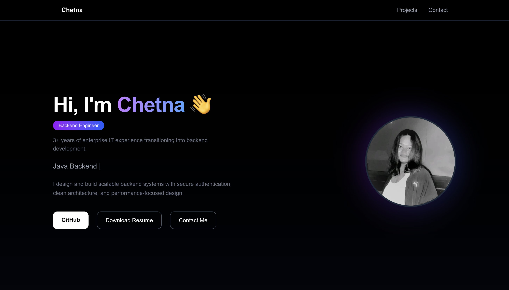

# 🚀 Chetna Shedame – Backend Developer Portfolio

A modern developer portfolio built using **Next.js, TypeScript, and Tailwind CSS** to showcase backend engineering projects and professional experience.

🔗 **Live Site:**  
https://chetna-portfolio.vercel.app

---


## 🌐 Preview

<p align="center">
  
</p>

---

## 👩‍💻 About

This portfolio highlights my transition into backend development and demonstrates:

- Java & Spring Boot backend projects  
- REST API design  
- Authentication & security implementation  
- Clean architecture principles  
- Production deployment workflow  

---

## 🛠 Tech Stack

- Next.js 16  
- TypeScript  
- Tailwind CSS  
- Framer Motion  
- Lucide React Icons  
- Vercel Deployment  

---

## ✨ Features

- Responsive modern UI  
- Sticky navigation bar  
- Animated hero section  
- Gradient styling  
- Interactive project cards  
- Contact section with icons  
- Resume download  
- CI/CD auto deployment via Vercel  

---

## 📂 Project Structure
app/
├── layout.tsx
├── page.tsx
public/
├── profile.png
├── Chetna_Resume.pdf


---

## ⚙️ Run Locally

Clone the repository:

```bash
git clone https://github.com/chetnashedame/chetna-portfolio.git
cd chetna-portfolio
npm install
npm run dev

Then open:

http://localhost:3000

## 📦 Deployment

This project is deployed on **Vercel**.  
Every push to the `main` branch automatically triggers a new production deployment.

---


## 🎯 Purpose

This project demonstrates:

- Frontend + deployment workflow  
- UI engineering fundamentals  
- Real-world debugging and package management  
- Professional presentation for backend job applications  
